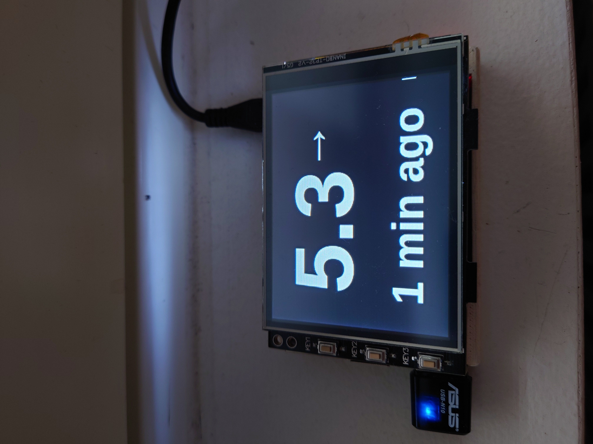

# Raspberry Pi Glucose Display

## Used components
- Raspberry Pi 2 Model B
- Joy-It RB-TFT3.2-V2 Touch Screen Display

## OS
PRETTY_NAME="Raspbian GNU/Linux 11 (bullseye)"
NAME="Raspbian GNU/Linux"
VERSION_ID="11"
VERSION="11 (bullseye)"
VERSION_CODENAME=bullseye
ID=raspbian
ID_LIKE=debian

## Overview
This playbook installs the display drivers and software to retrieve and display glucose values from Nightscout API. This project is very much work in progress.

